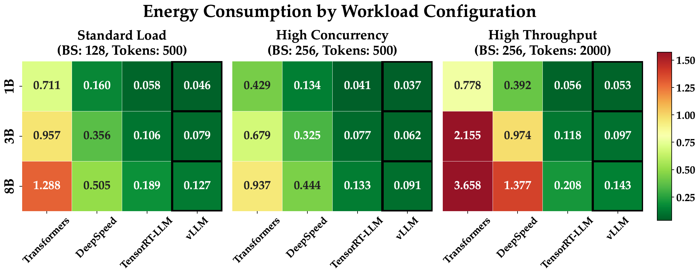

# LLM-Inference-Engine-Benchmark
A comprehensive benchmarking tool for measuring energy consumption and power efficiency of Large Language Model (LLM) inference engines including vLLM, DeepSpeed, TensorRT-LLM, and Transformers. Featured in HotCarbon '25.

## 🎯 Overview

This tool provides the first systematic evaluation of power consumption across multiple LLM inference engines, offering:

- **Multi-Engine Support**: Benchmarks vLLM, DeepSpeed, TensorRT-LLM, and Hugging Face Transformers
- **Fine-grained Analysis**: Separates inference lifecycle into setup and token generation stages
- **Component-wise Monitoring**: Tracks GPU, CPU, and DRAM power consumption separately
- **Comprehensive Metrics**: Measures energy per token, per response, and per second
- **Real-world Workloads**: Uses Alpaca dataset for realistic benchmarking scenarios

## 📊 Key Findings

Our research reveals that:
- **No single engine** universally optimizes energy efficiency across all scenarios
- **vLLM and TensorRT-LLM** excel in token generation efficiency under high-throughput workloads  
- **Transformers and DeepSpeed** are more efficient during the setup stage
- **Higher throughput** generally improves energy efficiency by amortizing fixed costs
- **GPU optimization** is critical as it dominates overall energy consumption (>50%)

## 🛠️ Features

### Multi-Stage Analysis
- **Setup Stage**: Engine initialization and model loading
- **Token Generation Stage**: Actual inference execution

### Component-wise Power Monitoring
- **GPU Power**: Using NVIDIA Management Library (NVML)
- **CPU Power**: Using Intel RAPL (Running Average Power Limit)
- **DRAM Power**: Memory subsystem power consumption
- **Total System Power**: Using IPMI for complete system monitoring

### Flexible Workload Configurations
- **Standard Load**: Batch size 128, 500 output tokens
- **High Concurrency**: Batch size 256, 500 output tokens  
- **High Throughput**: Batch size 256, 2000 output tokens

## 🚀 Quick Start

### Prerequisites

```bash
# System requirements
- Python 3.8+
- NVIDIA GPUs with CUDA support
- Intel CPUs with RAPL support (for CPU power monitoring)
- IPMI tools (for total system power monitoring)
```

### Installation

1. **Clone the repository**:
   ```bash
   git clone https://github.com/chenxuniu/LLM-Inference-Engine-Benchmark.git
   cd LLM-Energy-Benchmark
   ```

2. **Create virtual environment**:
   ```bash
   python3 -m venv venv
   source venv/bin/activate  # On Linux/macOS
   # venv\Scripts\activate  # On Windows
   ```

3. **Install dependencies**:
   ```bash
   pip install torch transformers datasets nvidia-ml-py
   
   # Install specific engines (choose based on your needs)
   pip install vllm                    # For vLLM
   pip install deepspeed              # For DeepSpeed  
   pip install tensorrt-llm           # For TensorRT-LLM
   ```

4. **Setup system permissions**:
   ```bash
   # For RAPL CPU power monitoring
   sudo chmod +r /sys/class/powercap/intel-rapl/*/energy_uj
   
   # For IPMI total power monitoring
   sudo modprobe ipmi_devintf
   sudo modprobe ipmi_si
   ```

### Basic Usage

```bash
# Benchmark vLLM with Llama models
python llm_benchmark.py \
  --engine vllm \
  --models "TinyLlama/TinyLlama-1.1B-Chat-v1.0,meta-llama/Llama-2-7b-chat-hf" \
  --batch-sizes "128,256" \
  --output-tokens 500 \
  --num-samples 1024

# Benchmark all engines with different workloads
python llm_benchmark.py \
  --engine transformers \
  --models "TinyLlama/TinyLlama-1.1B-Chat-v1.0" \
  --batch-sizes "128,256" \
  --output-tokens 2000 \
  --num-samples 2048
```

## 📈 Sample Results

Our benchmarks on NVIDIA H100 GPUs show:

| Engine | Energy/Token (mJ) | Setup Time (s) | Peak Power (W) |
|--------|-------------------|----------------|----------------|
| vLLM | **37** | 48.4 | 1382 |
| TensorRT-LLM | **91** | 30.2 | 1003 |
| DeepSpeed | 356 | **2.9** | 1063 |
| Transformers | 711 | **2.9** | 1055 |

Energy Per Token Results: (Heat Map):



The relationship between throughput and energy per token:


*Results for Llama3.1-8B under High Throughput workload (BS: 256, Tokens: 2000)*

## 📁 Project Structure

```
LLM-Energy-Benchmark/
├── llm_benchmark.py          # Main benchmarking script
├── power_monitor.py          # Power monitoring utilities
├── engines/
│   ├── vllm_engine.py       # vLLM wrapper
│   ├── deepspeed_engine.py  # DeepSpeed wrapper
│   ├── transformer_engine.py # Transformers wrapper
│   └── trtllm_engine.py     # TensorRT-LLM wrapper
├── results/                 # Benchmark results (JSON)
├── figures/                 # Research paper figures
└── README.md
```

## 🔧 Advanced Configuration

### Custom Datasets
```python
# Modify prompts in llm_benchmark.py
prompts = load_alpaca_dataset(min_length=10, max_length=100)
```

### Multiple GPU Setup
The tool automatically detects and utilizes multiple GPUs when available:
- **vLLM**: Automatic tensor parallelism across GPUs
- **DeepSpeed**: Distributed inference configuration
- **TensorRT-LLM**: Multi-GPU optimization

### Custom Metrics
Extend the `PowerMonitor` class to add custom metrics:
```python
def custom_metric_calculation(self, duration, tokens):
    # Your custom energy efficiency metric
    return energy_per_complexity_unit
```

## 📊 Output Metrics

The tool provides comprehensive energy efficiency metrics:

### Per-Token Metrics
- Energy per token (J/token)
- Component breakdown (GPU/CPU/DRAM)
- Comparison across engines and models

### Per-Response Metrics  
- Total energy per response
- Latency vs energy trade-offs
- Throughput efficiency analysis

### System-Level Metrics
- Power consumption over time
- Component utilization patterns
- Thermal and efficiency curves

## 🤝 Contributing

We welcome contributions! Please:

1. Fork the repository
2. Create a feature branch (`git checkout -b feature/new-engine`)
3. Make your changes
4. Add tests for new functionality
5. Submit a pull request

### Adding New Engines
To add support for a new inference engine:

1. Create a new engine wrapper in `engines/`
2. Implement the required interface methods:
   - `setup_model()`
   - `run_inference()`
   - `run_benchmark()`
   - `estimate_tokens()`

<!-- ## 📄 Citation

If you use this tool in your research, please cite our paper:

```bibtex
@inproceedings{energy-efficient-llm-benchmark-2025,
  title={Energy Efficient or Exhaustive? Benchmarking Power Consumption of LLM Inference Engines},
  author={Anonymous Author(s)},
  booktitle={Proceedings of the 6th Workshop on Sustainable Computer Systems (HotCarbon '25)},
  year={2025},
  publisher={ACM}
}
``` -->

<!-- ## 📜 License

This project is licensed under the MIT License - see the [LICENSE](LICENSE) file for details. -->

## 🔗 Related Work

- [vLLM](https://github.com/vllm-project/vllm) - High-throughput LLM serving
- [DeepSpeed](https://github.com/microsoft/DeepSpeed) - Distributed training and inference
- [TensorRT-LLM](https://github.com/NVIDIA/TensorRT-LLM) - NVIDIA optimized inference
- [Transformers](https://github.com/huggingface/transformers) - Hugging Face model library

## 🛟 Support

- **Email**: ncxhxgtg@gmail.com

---

**Note**: This tool requires specific hardware (NVIDIA GPUs, Intel CPUs with RAPL) and system permissions for accurate power monitoring. See the installation guide for detailed setup instructions.
